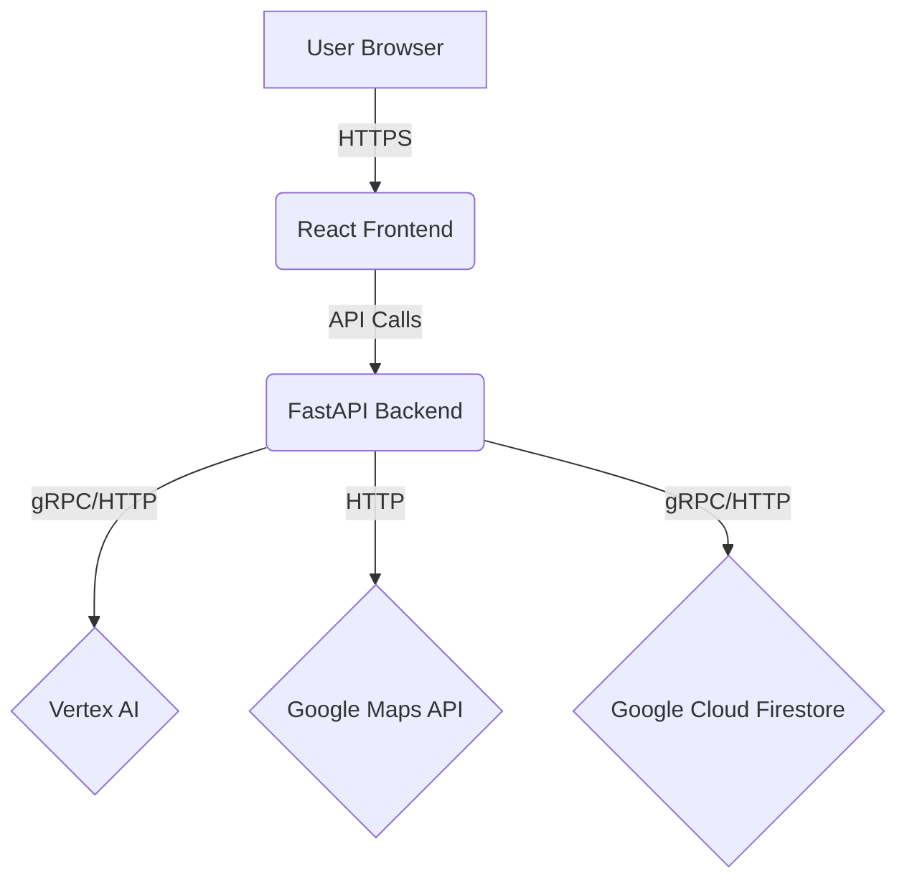

# Election Assistant - Smart Civic Engagement

## Overview
This is an AI-powered Election Assistant built with Google **Cloud Run**, FastAPI, React, and **Vertex AI**. It is designed to provide secure, intelligent guidance and streamline the civic engagement process.

## Features
* Gemini chatbot for answering election-related queries with neutral, process-oriented guidance. Designed by **Anti-Gravity PromptWars** leveraging advanced **Prompt Engineering**.
* Google Maps polling location integration to help users find where to vote.
* Strict Content Security Policy (CSP) to ensure robust frontend security.

## Architecture
The application features a decoupled architecture with a React frontend for the user interface and a Python FastAPI backend for handling logic and API requests. Google Secret Manager is utilized to securely store and access sensitive environment variables.

## Local Setup
1. Install backend dependencies: `cd backend && python -m venv venv && source venv/bin/activate && pip install -r requirements.txt` (or `venv\Scripts\activate` on Windows).
2. Install frontend dependencies: `cd frontend && npm install`.
3. Run the backend locally: `uvicorn app.main:app --reload`.
4. Run the frontend locally: `npm run dev`.
